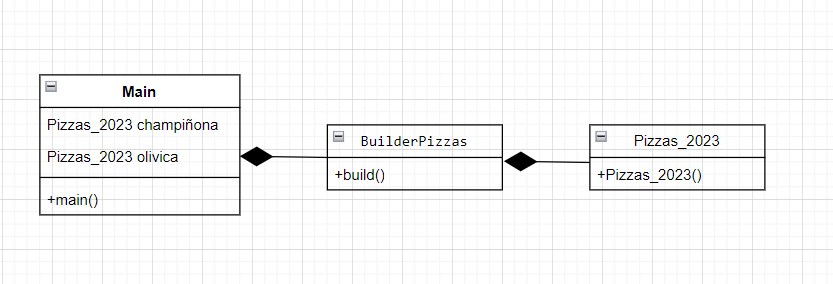
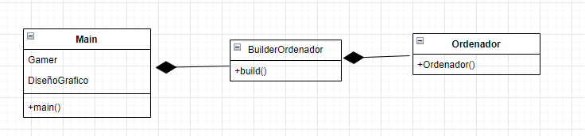

¿Cual es la función de este patrón?

Tener creados los build con los valores basicos predeterminados que queramos, por ejemplo para recetas,
de esta manera no tenemos que pasar los datos uno por uno y podemos hacerle las modificaciones que mas nos apetezca usando los .set

¿Como es su Diagrama de clases? Realiza en el readme el diagrama

¿Podríamos combinarlo con el patrón Factory?

Si, asi tendriamos todo más organizado a la hora de realizar proyectos más grandes, 

supongo que podria ser una buena practica para ahorrrar codigo y tiempo.

-----------------------EXAMEN--------------------------

¿Cual es la función del patrón builder? Pon ejemplo (que no sea Pizzas)

Con el patron builder podemos tener muchas caracteristicas por ejemplo en mi caso con Ordenador;
algunas atributos que podemos poner con el tamaño de la pantalla, calidad de imagen, tipo de tarjeta grafica, memoria ram, discoduro, etc
de esta manera podemos crear un constructor basico que luego podremos modificar para que nos cree distintos tipos de ordenador, 
por ejemplo para "gamer" que tenga unas caracteristicas concretas
o crear uno para trabajadores de diseño grafico que necesitaran otros requisitos.

¿Como es su Diagrama de clases de este ejemplo que has hecho? Realiza en el readme el diagrama

¿Podríamos combinarlo con el patrón Factory? Explícalo con algo de código como lo harías
Pienso que seria una buena idea combinar ambos patrones, en este caso crearia una interface con los metodos comunes que vayan a usar mis clases,
crearia unas constantes para los distintos tipos de ordenador asi estariamos usando el patron factory y añadiria las ventajas del builder creando
los constructores de los distintos tipos de ordenador, en caso de que usemos por ejemplo la constante gamer el constructor nos creara el ordenador
con las caracteristicas que le tenemos designadas y en caso de que el usuario quiera alguna expecificacion concreta de su ordenador podremos modificarlas
metiante los setters.

  
